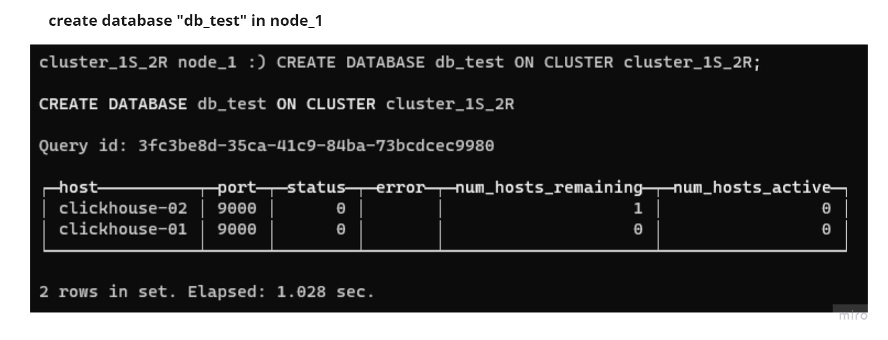

# CLICKHOUSE-REPLICA-DOCKER

Implementing Clickhouse Deployment [Replica for fault tolerance](https://clickhouse.com/docs/en/architecture/replication) in docker

## Testing
### Create database **db_test** in node_1

### Check database **db_test** in node_2
.jpg)